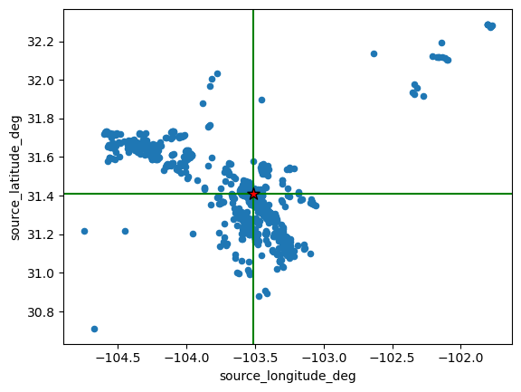
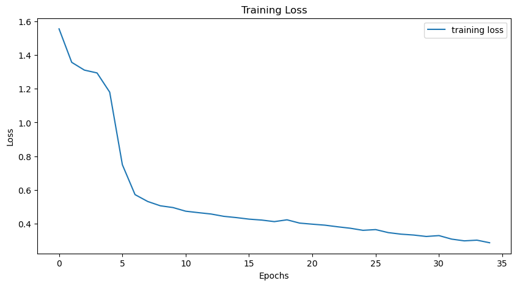
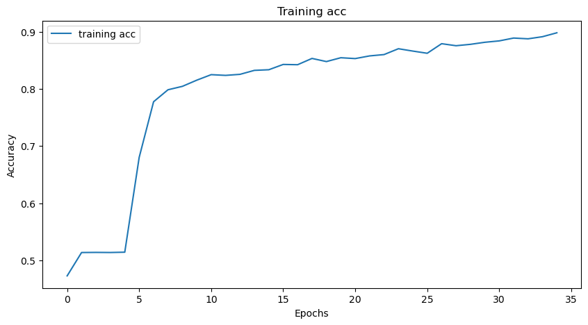

Neural Network
====================

The neural network used was an adaptation from the `ConvNetQuake <https://github.com/tperol/ConvNetQuake>`_
since this neural network objective was to detect and locate events from a single waveform he modify it to instead
clasify events detected from a single station according to a zone around the station that the event occurred.

The Neural Network was adapted using the open-source `SeisBench`_ python toolbox.

.. Contents ::
    

Data
----
The data used was from the data benchmarks from `SeisBench`_. `TXED`_ dataset is a benchmark dataset of local seismic signals in the state of Texas. In total there are ~500,000 time series encompassing 20,000 earthquakes (~300,000 traces) and noise traces (~200,000 traces).
However, since we trained the Neural Network for only one statation, which was the station PCOS located at **Lat: 31.41** and **Lon: -103.510147**. The events around this station were 975 earthquakes.
Varios criteria for clasification was tested and the one that yielded the best results was to clasify by quadrants taking the station as the origin. Events to classify noice were also added.

To Modify the data we used the metadata.csv file that seisbench downloads when you use the TXED dataset.

::

    import numpy as np
    import pandas as pd
    import matplotlib.pyplot as plt
    import geopandas as gpd
    import seisbench.data as sbd

    metadatos.loc[(metadatos['source_longitude_deg']>= -103.510147) & (metadatos['source_latitude_deg']>=31.408922),'ID_poligono'] = 1
    metadatos.loc[(metadatos['source_longitude_deg']<= -103.510147) & (metadatos['source_latitude_deg']>=31.408922),'ID_poligono'] = 2
    metadatos.loc[(metadatos['source_longitude_deg']<= -103.510147) & (metadatos['source_latitude_deg']<=31.408922),'ID_poligono'] = 3
    metadatos.loc[(metadatos['source_longitude_deg']>= -103.510147) & (metadatos['source_latitude_deg']<=31.408922),'ID_poligono'] = 4

Distribution
------------

For training purposes we split the data in trainig and testing, however since we don't have enough data to confidently train the network with 70% of the Data
we use a different split, that is 1938 for training and 229 for testing, including noice instances.

=========  ========  =======
Data with  Training  Testing
=========  ========  =======
Noice      1938      229
No Noice   914       61
=========  ========  =======

We load the data using the class Dataloader from Torch(`Torch Dataloader`_) and the `SeisBench`_ *GenericGenerator*. Using this classes we normalize the data and detrend it as well. 
The size of batch used to process the data was 150.

Model
-----
The model is an adaptation from the `ConvNetQuake <https://github.com/tperol/ConvNetQuake>`_ and looks like the following way
::

    import torch.nn as nn
    class modelo_convnetquake(SeisBenchModel):  #               
        def __init__(self, citation=None, num_classes=10, regularization=0.000875, input_length=3001, sampling_rate=100):
            self.regularization = regularization

            super().__init__()
            # Parámetros
            c = 32  # número de canales por capa conv
            ksize = 3  # tamaño del kernel de la convolución
            depth = 8  # profundidad de la red
            self.device = torch.device("cuda" if torch.cuda.is_available() else "cpu")
            # Capas convolucionales
            layers = []
            in_channels = 3
            for i in range(depth):
                layers.append(nn.Conv1d(in_channels, c, kernel_size=ksize, stride=2, padding=1))
                layers.append(nn.ReLU())
                in_channels = c
                self.conv_layers = nn.Sequential(*layers)

            # Dummy input para calcular el tamaño de la salida
            dummy_input = torch.zeros(1, 3, input_length).to(self.device)
            output_size = self.conv_layers(dummy_input).numel()

            # Capa completamente conectada
            self.fc = nn.Linear(output_size, num_classes)

        def forward(self, x):
            print(f"Input shape: {x.shape}")
            x = self.conv_layers(x)
            print(f"Shape after conv layers: {x.shape}")
            x = x.view(x.size(0), -1)
            logits = self.fc(x)

            return logits
        
        def loss_func(self,logits,targets):
            loss = nn.CrossEntropyLoss()(logits, targets)
            reg_loss = self.regularization * sum(param.norm(2) for param in self.parameters())
            return loss + reg_loss

        def accuracy(self, logits,targets):
            # hay dos accuracies en el modelo original, se enfocara en "location accuracy"
            predictions = torch.argmax(logits, dim=1)
            correct = (predictions == targets).float()
            accuracy = correct.sum() / len(correct)
            return accuracy

When we call the model, we still do some modification to the initial parameters, like number of classes (5) and input size (6001) according to the available data.
The learning rate was set to 0.001 and the optimizer was `ADAM <https://pytorch.org/docs/stable/generated/torch.optim.Adam.html>`_. The number of epochs was set to 35

Training
--------

For the training one of the hyperparameters that was the most usefull was the *regularization* inside the model as well as the learning rate, 
since  they seem to be the ones that changed the learning curve the most.

The accuracy before adding the noice was around 70% but the final result with the was of nearly 90%

.. _SeisBench: https://seisbench.readthedocs.io/en/stable/index.html
.. _TXED: https://seisbench.readthedocs.io/en/stable/pages/benchmark_datasets.html#txed
.. _Torch Dataloader: https://pytorch.org/docs/stable/data.html